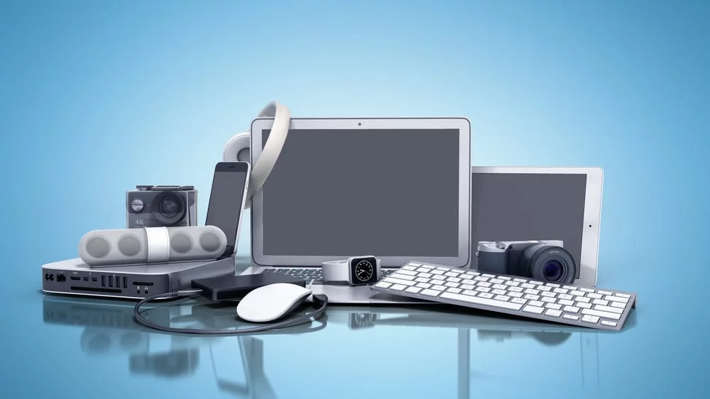
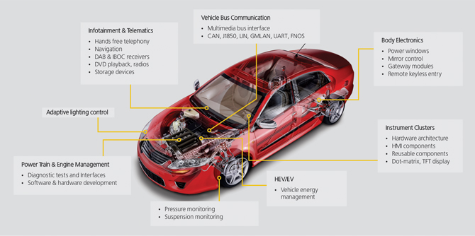
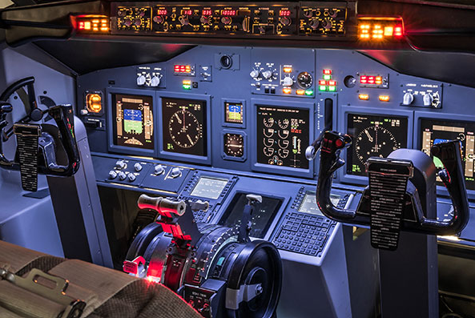
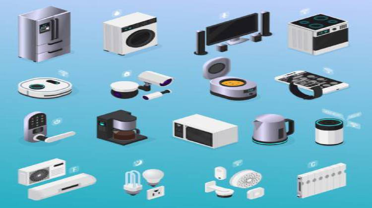
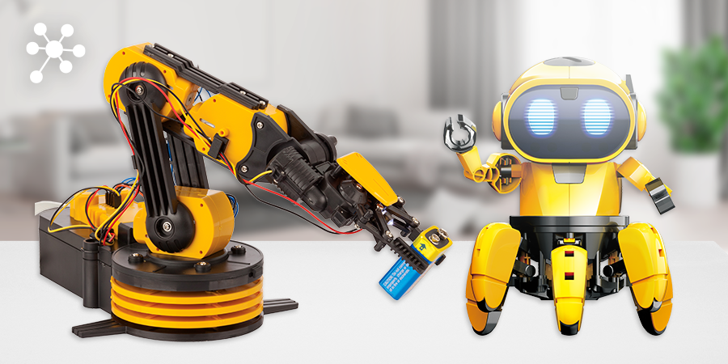
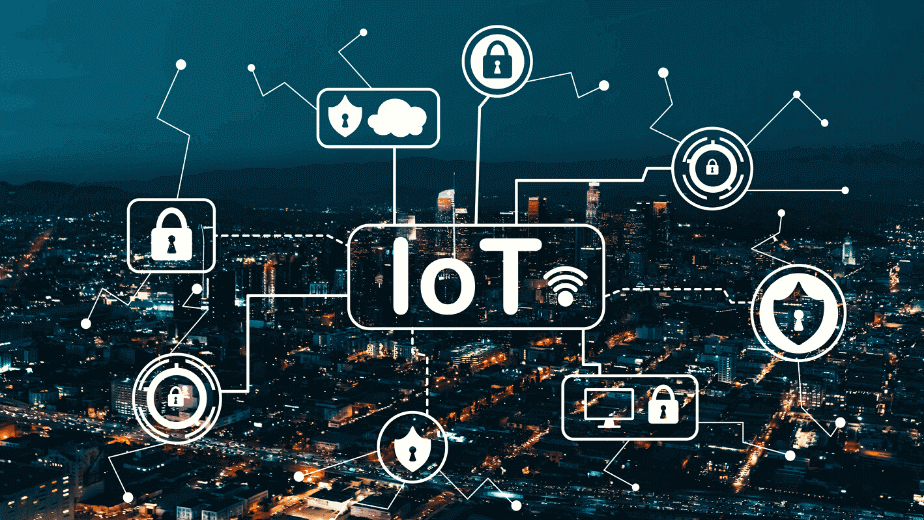
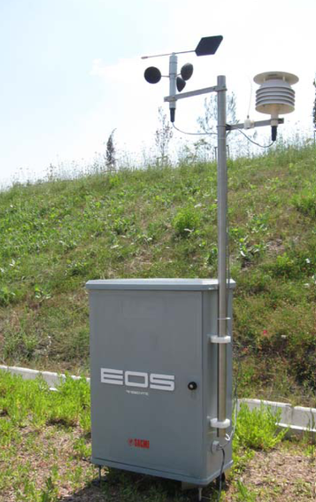

# Applications of embedded systems

Now that you are convinced that how important and exciting it is to learn embedded systems, you now want to learn more about where all these devices play role in serving and helping us to enhance our lives.

Embedded systems have a wide range of applications in our daily lives. Here are some fascinating applications of embedded systems:

1. Consumer Electronics: Many of the devices we use every day, such as smartphones, smartwatches, fitness trackers, and gaming consoles, contain embedded systems. These systems enable communication, data processing, and user interaction, making our lives easier and more enjoyable.

2. Automotive: Embedded systems are extensively used in automobiles. They control various functions such as engine management, anti-lock braking systems (ABS), airbag deployment, GPS navigation, entertainment systems, and vehicle diagnostics. They enhance safety, improve fuel efficiency, and provide a smooth driving experience.

3. Aerospace and Aviation: Embedded systems are crucial in aircraft and spacecraft, managing various systems, including flight controls, navigation, communication, and monitoring critical parameters. They ensure the safety and efficiency of air and space travel.

4. Home Automation: Embedded systems play a crucial role in home automation systems. They control and manage smart devices such as thermostats, lighting systems, security systems, and appliances. They enable remote monitoring and control, energy efficiency, and increased convenience.

5. Healthcare: In the medical field, embedded systems are used in various devices, including pacemakers, insulin pumps, continuous glucose monitoring systems, and medical imaging equipment. These systems ensure accurate diagnosis, treatment, and monitoring of patients, improving healthcare outcomes.

6. Industrial Applications: Embedded systems are widely used in industrial automation for controlling and monitoring manufacturing processes. They enable tasks such as machine control, process optimization, inventory management, and quality control. These systems improve productivity, efficiency, and consistency in manufacturing operations.

7. Robotics: Embedded systems are the backbone of robotics. They control the movement, sensing, and decision-making capabilities of robots. Robots are used in various industries, including manufacturing, healthcare, exploration, and agriculture, to perform tasks that are dangerous, repetitive, or require high precision.

8. IoT (Internet of Things): Embedded systems are essential in building the IoT ecosystem. They connect everyday objects to the internet, enabling remote control, data collection, and intelligent decision-making. IoT applications include smart homes, smart cities, environmental monitoring, agriculture, and logistics.

9. Environmental Monitoring: Embedded systems are used to monitor and manage environmental parameters, such as air quality, temperature, and humidity. They help in gathering data for climate studies, pollution control, and weather forecasting.

These are just a few examples of the many exciting applications of embedded systems. They are all around us, making our lives more convenient, efficient, and enjoyable.
