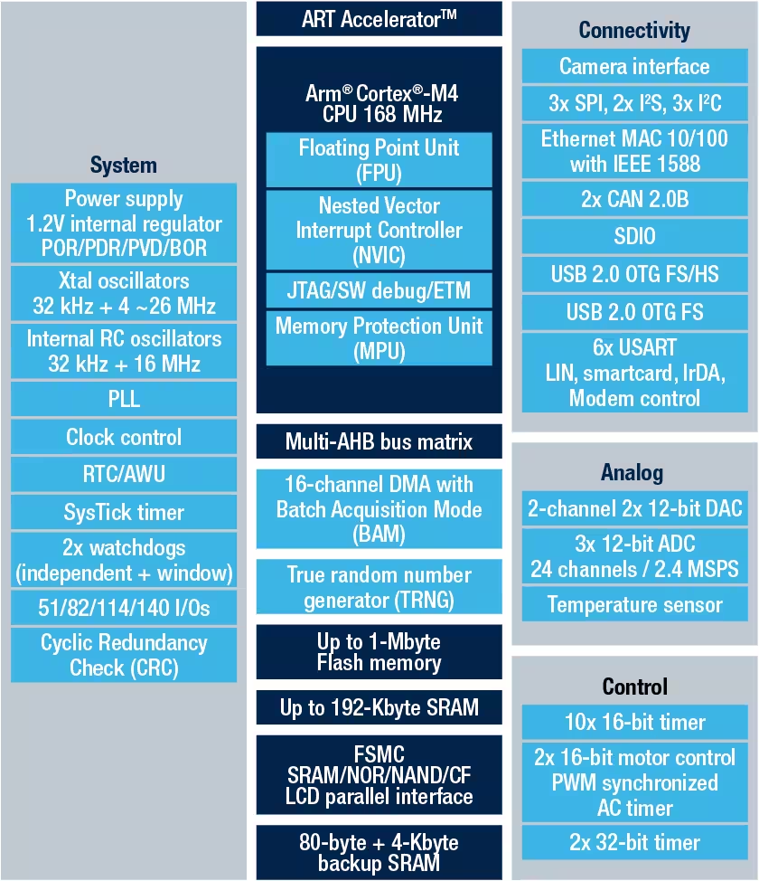

# STM32F407VGT6 microcontroller and its features

The STM32F407G-DISC1 board hosts STM32F407VG microcontroller.

Here are the key features of STM32F407VG microcontroller:

* Core: Arm® 32-bit Cortex®-M4 CPU with FPU, Adaptive real-time accelerator (ART Accelerator) allowing 0-wait state execution from Flash memory, frequency up to 168 MHz, memory protection unit, 210 DMIPS/ 1.25 DMIPS/MHz (Dhrystone 2.1), and DSP instructions

* Memories
    – 1 Mbyte of Flash memory
    – Up to 192+4 Kbytes of SRAM including 64-Kbyte of CCM (core coupled memory) data RAM
    – 512 bytes of OTP memory
    – Flexible static memory controller supporting Compact Flash, SRAM,PSRAM, NOR and NAND memories

* LCD parallel interface, 8080/6800 modes

* Clock, reset and supply management
    – 1.8 V to 3.6 V application supply and I/Os
    – POR, PDR, PVD and BOR
    – 4-to-26 MHz crystal oscillator
    – Internal 16 MHz factory-trimmed RC (1% accuracy)
    – 32 kHz oscillator for RTC with calibration
    – Internal 32 kHz RC with calibration

* Low-power operation
    – Sleep, Stop and Standby modes
    – VBAT supply for RTC, 20×32 bit backup registers + optional 4 KB backup SRAM

* 3×12-bit, 2.4 MSPS A/D converters: up to 24 channels and 7.2 MSPS in triple interleaved mode

* 2×12-bit D/A converters

* General-purpose DMA: 16-stream DMA controller with FIFOs and burst support

* Up to 17 timers: up to twelve 16-bit and two 32- bit timers up to 168 MHz, each with up to 4 IC/OC/PWM or pulse counter and quadrature (incremental) encoder input

* Debug mode
    – Serial wire debug (SWD) & JTAG interfaces
    – Cortex-M4 Embedded Trace Macrocell™

* Up to 140 I/O ports with interrupt capability
    – Up to 136 fast I/Os up to 84 MHz
    – Up to 138 5 V-tolerant I/Os

* Up to 15 communication interfaces
    – Up to 3 × I2C interfaces (SMBus/PMBus)
    – Up to 4 USARTs/2 UARTs (10.5 Mbit/s, ISO 7816 interface, LIN, IrDA, modem control)
    – Up to 3 SPIs (42 Mbits/s), 2 with muxed full-duplex I2S to achieve audio class accuracy via internal audio PLL or external clock
    – 2 × CAN interfaces (2.0B Active)
    – SDIO interface

* Advanced connectivity
    – USB 2.0 full-speed device/host/OTG controller with on-chip PHY
    – USB 2.0 high-speed/full-speed device/host/OTG controller with dedicated DMA, on-chip full-speed PHY and ULPI
    – 10/100 Ethernet MAC with dedicated DMA: supports IEEE 1588v2 hardware, MII/RMII

* 8- to 14-bit parallel camera interface up to 54 Mbytes/s

* True random number generator

* CRC calculation unit

* 96-bit unique ID

* RTC: subsecond accuracy, hardware calendar

In this course, we will build projects and learn how to program the microcontroller to use these features effectively for our use-cases.
