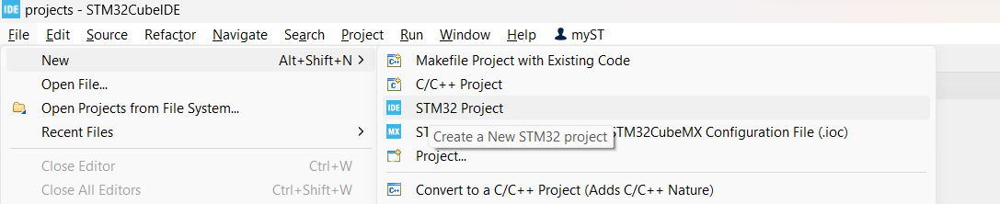
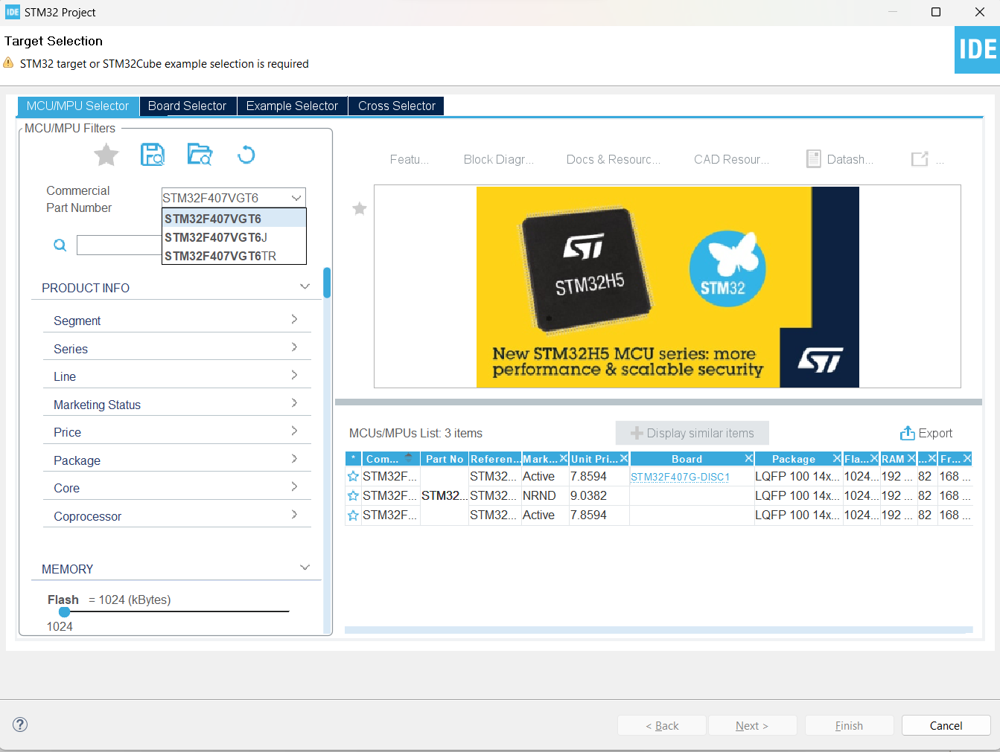
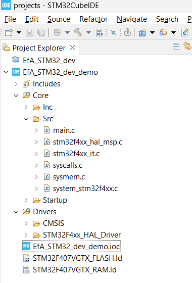
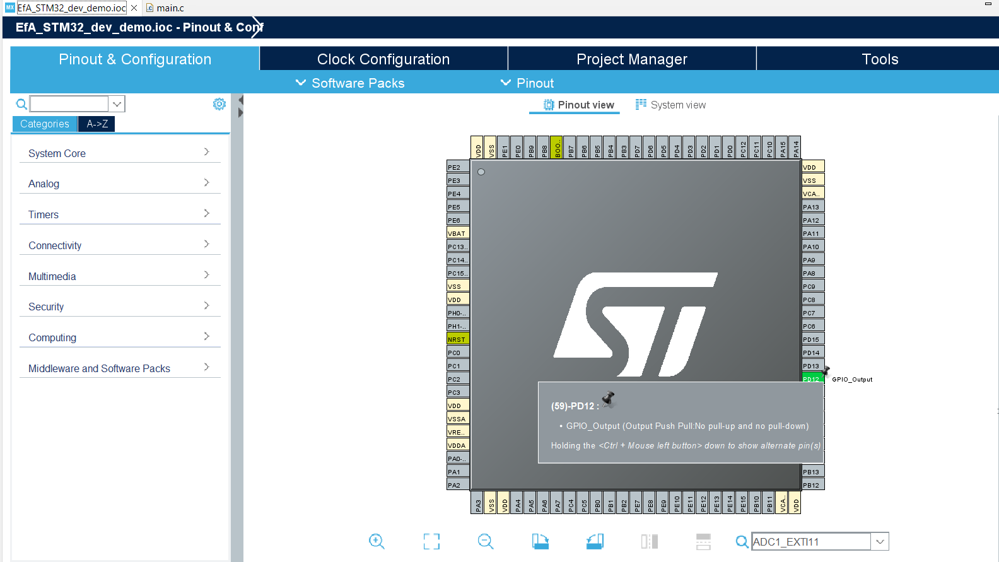
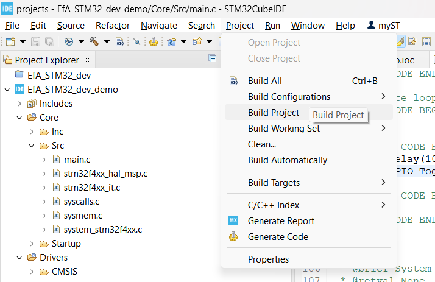
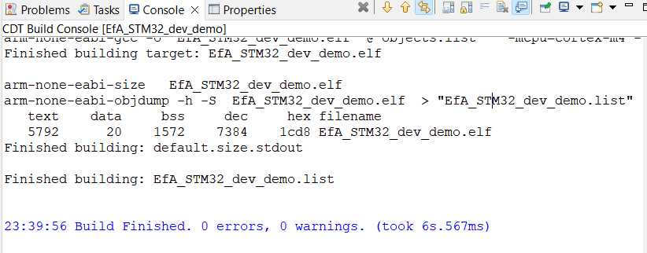

# Setting up the development environment with STM32CubeIDE

Now that we are aware of some of the basics to start with embedded systems, its is time to setup development environment.


An embedded development environment refers consists of set of tools, software, and hardware used by developers to create, test, and debug software for embedded systems.

Here are some essential components of an embedded development environment we need:

1. Integrated Development Environment (IDE): An IDE is a software application that provides a comprehensive development environment with code editor, compiler, debugger, and other tools. It enables developers to write, compile, and debug code efficiently. Some popular IDEs for embedded development include Eclipse, Visual Studio Code, Keil µVision, and IAR Embedded Workbench. We use STM32CubeIDE.  It combines the STM32CubeMX code configuration tool with the Eclipse-based IDE, making it easy to develop applications for STM32 microcontrollers.

2. Cross-Compiler: Embedded systems usually use processors with architectures different from the host machine. A cross-compiler is a toolchain that runs on the host machine but generates executable code for the target embedded platform.

3. Debugger and Emulator: Debugging is crucial in embedded development. Debugging tools allow developers to track down and fix issues in their code. Emulators and simulators enable testing and debugging of code without running it on the actual target hardware. STM32F407G-DISC1 board comes with On-board ST-LINK/V2-A debugger/programmer with USB re-enumeration capability: mass storage, Virtual COM port, and debug port

4. Hardware Development Kit (HDK): An HDK provides the necessary hardware components and interfaces to connect the host machine to the target embedded system. It can include development boards, evaluation kits, and debugging interfaces. We use STM32F407G-DISC1 board and we will be able to interface different hardware components to this board and develop applications.

5. Flash Programmer: A flash programmer is used to write the compiled code into the flash memory of the embedded system. STM32F407G-DISC1 board comes with On-board ST-LINK/V2-A debugger.

6. Peripheral Libraries and Drivers: Embedded systems often interact with various hardware peripherals like sensors, displays, communication interfaces, etc. Libraries and drivers are necessary to handle the communication between the embedded software and these peripherals. STM32Cube software development platform offer various pre-compiled software packages and examples for various applications, such as USB, FreeRTOS, and more. This  help speed up development and provide standardized solutions for common functionalities.

## Development environment Set up with STM32CubeIDE

 Below are the steps to set up an embedded development environment using STM32CubeIDE:

1. Install STM32CubeIDE

    Download the latest version of STM32CubeIDE from the official [STMicroelectronics website](https://www.st.com/en/development-tools/stm32cubeide.html). It will ask you to provide your email address and send a link to your email. You click the link and download the latest software version, then follow instructions to install it on your machine (either Windows, Mac or Linux).

2. Create a New Project

    First time opening STM32CubeIDE, it will show initial screen which has links to guides and other resources which help you get started. They are useful as you can use them as a reference when needed. They can be accessed by clicking Help > Information Center.

    Now, click File > New > STM32 Project.

    

    It will download more information from STMicroelectronics’ server and show Target selection dialog where you can select STM32 target. You can see there are 4 tabs: MCU/MPU Selector, Board Selector, Example Selector and Cross Selector. We will start with MCU/MPU Selector where you can choose STM32F407VGT6 target STM32 chip as we are using STM32F407G-DISC1 board which hosts STM32F407VGT6 target. Once you type in the part number, you will see on the right hand side showing 3 items. Select the STM32F407G-DISC1 with LQFP 100 14x14x1.4 mm package which is the board we are using.

    

    It is very handy to have all the information about the chip loaded. The STM32CubeIDE retrieves chip information from ST server and show chip feature, block diagram, docs and resources and datasheet all in one place. Compared with other IDEs, STM32CubeIDE is really great in terms of documentations. You can download the documents that you are interested in and use them as reference when needed. After that, click Next button.

    The following dialog asks you to enter a name for the project, which we will name EfA_STM32_dev_demo and select target language, which we will use C. Then Click Next and Finish. The STM32CubeIDE will download necessary files and create a project for us. Wait a little while until the process finishes.

3. Understanding project structure

    On the left hand side of the STM32CubeIDE is the Project Explorer where your project files are organized.

    

    It is worth to mention a few important files in the project. Gradually, we will learnt all of them, but we will look at a few of them in this getting started guide.
    * get_started.ioc: If you double-click the file, it will open device configuration tool where you can configure the STM32 chip. There are several tabs:
        * Pinout & Configuration: In this tab, you can see a diagram of the chip with all of its pin. You can, for example, configure a pin as an output port, and configure another pin as an input port. The diagram is very handy as you don’t need to remember pin location. Here you can configure various system core parameters and peripherals.
        * Clock configuration: There’s a diagram for configuring system clock.
        * Project Manager: This tab stores project-related settings and rules for automatically generating code based on selected configuration.
        * If you make change in Pinout & Configuration tab, for example, you set a pin as an output port, and Save it, the IDE will ask you whether you want to generate code automatically. Click Yes and code will be generated in appropriate place in main.c for you.
    * STM32F103VBTX_FLASH.ld: This is the linker script which specifies where your code reside in physical memory. You can see the addresses of RAM and FLASH, as well as their respective sizes. To learn more about the meaning of this linker script file, check out the STM32CubeIDE User Guide. You can find this document in Help > Information Center > STM32CubeIDE User Guide.
    * main.c: This is where your main application goes. If you take a close look at the file, you will see that there are sections of code that are automatically generated for you based on your configuration. There are other sections that you can place your code, as indicated by comment lines. You should put your code in these sections and try to avoid messing up with auto-generated code.

4. Adding your code

    We will be implementing a simple blinky project in which we toggle an LED that is connected to a GPIO pin every second. On STM32F407G-DISC1 board, we use User LD4: green LED is a user LED connected to the I/O PD12 of the STM32F407VGT6.

    First we need to open get_started.ioc. Click on PD12 in the chip diagram and select GPIO_Output.

    

    Click Save and hit Yes to enable generating code automatically. Then open main.c and paste the following code in the while() loop:

    ```rb
    /* Infinite loop */
    while (1)
    {
        HAL_Delay(1000);
        HAL_GPIO_TogglePin(GPIOD, GPIO_PIN_12);
    }
    ```

    This snippet does a simple thing: toggle the GPIO D10 every 1 second which makes the LED on and off repeatedly with frequency of 1 Hz. Save main.c

5. Build project

    To compile the project and generate binary files, click Project > Build Project from the menu.

    

    You should see the log messages printed on the console. By inspecting the log messages, you can infer how STM32CubeIDE works internally, which tools it invokes, and the result of the build process. Here is the extract of the last part of the build log.

    

6. Flash and run the program on the target STM32

    Before connecting the STM32F4DISCOVERY board to a Windows® PC (7, 8 and 10) through the USB, a driver for the ST-LINK/V2-A must be installed. It is available at [STMicroelectronics website](https://www.st.com/en/development-tools/stsw-link009.html#get-software). Download and install.

    To flash and run the program, you’ll need to create a Run configuration from Run > Run configurations... where you need to specify the programmer or debug probe to use. You can use ST-LINK probe as STM32F4DISCOVERY board comes with onboard ST-LINK/V2-A to program/debug.

    

    It will load the firmware to target chip and reset the chip. If flashing is successful, you will see the LED blinks every 1 second as expected.

    

With this we can say that our development environment set up ready to work with STM32F407G-DISC1 board and STM32CubeIDE.
